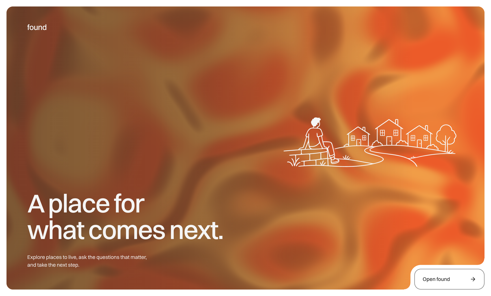
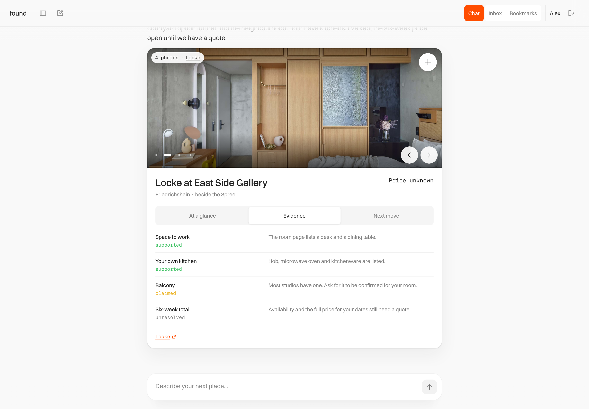
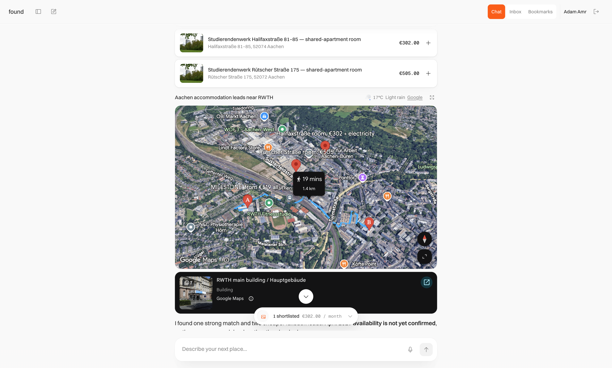
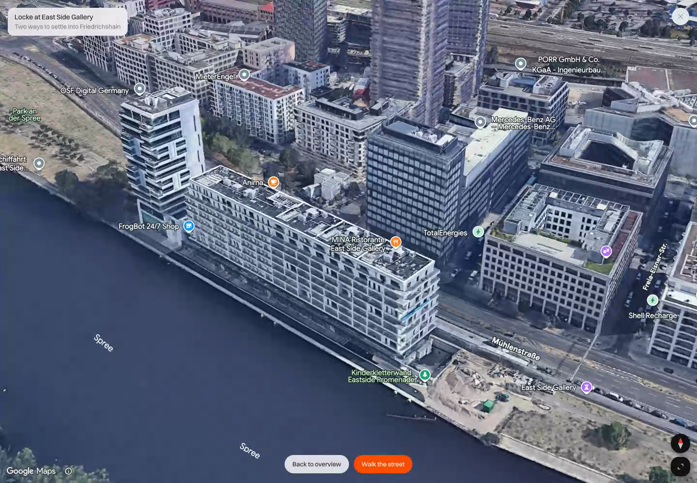
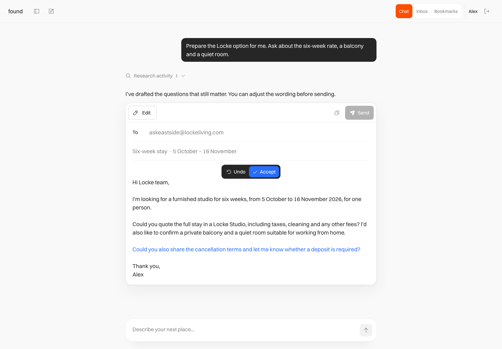

# Found

An app for finding accommodation and contacting places you’re interested in.

[Try Found](https://mellow-hamster-66.convex.site/)

[Watch the walkthrough](https://adamamr.me/projects/found/)

[](https://mellow-hamster-66.convex.site/)

## Why I built it

I’m hoping to do my bachelor’s thesis in Germany, and my own accommodation
search gave me the idea for Found. I wanted help finding somewhere to stay and
following up with places I liked. I got fairly invested in the interaction
design and maps integration possibilities along the way.

I designed and built Found for the Convex All Gas Hackathon. It connects
researching a place with exploring its surroundings, contacting it, and
following the reply, so the search can continue past a list of links.

## Finding somewhere to stay

Start by describing what you need. Found researches accommodation and brings
places into the conversation as interactive cards, with photographs, details,
and sources you can inspect. When more context would help, it can ask questions
through an interactive questionnaire without making you fill out a long form
before searching.

Each candidate brings together an overview, evidence, and a next step. The
evidence view distinguishes what the sources support from what still needs an
answer. A place might include bills but leave availability unclear. You can
check the source, compare candidates, and save places to revisit in Bookmarks.



## Explore the place, not just the listing

Selecting a place flies the camera down to it and settles into a slow orbit
around the building in 3D. Explore nearby places, inspect the route to where
you’d study or work, and enter Street View to look around the neighbourhood.

The map and conversation work together. You can expand the map to explore,
then return to the research without losing the place you were considering.
The camera movements and transitions are part of how Found helps you build a
sense of somewhere you haven’t visited yet.





## From a question to an email

Ask Found to draft an inquiry about a place. The email appears inside the
conversation, where you can review the recipient, subject, and message.

Describe a change and the proposed edits appear highlighted in the email,
with Accept and Undo controls. You can keep refining it before sending.
Sending requires your approval of the final content.

The Inbox keeps sent inquiries and replies in the app, so you can follow up
on the same search instead of moving everything into a separate email workflow.



## The interface

Found uses a light interface with orange accents, expandable candidate cards,
and email editing built into the conversation. I worked on the movement between
those states as well as the screens themselves: map camera transitions,
highlighted email revisions, research activity, and the sending animation.

The landing page has a moving orange shader behind “A place for what comes
next.” The sign-in screen carries that palette into a dither shader, and ASCII
animations appear elsewhere in the experience. The
[portfolio walkthrough](https://adamamr.me/projects/found/) shows these details
in motion.

## How it’s built

- **TanStack Start and React 19** for the application and interface.
- **Convex** for authentication, durable state, real-time updates, agent threads,
  workflows, and static hosting.
- **OpenAI and the AI SDK** for the assistant, with **Firecrawl** for web research.
- **Google Maps** for place and route context, interactive maps, 3D exploration,
  and Street View.
- **AgentMail** for sending approved emails, delivery state, and incoming replies.
- **Effect v4** for typed integration failures and external service boundaries.
- **Tailwind CSS v4** and a product-owned [design system](./docs/DESIGN_SYSTEM.md).

The assistant returns structured, validated content that the app renders as
interactive UI. It does not generate executable React. Candidate results stay
attached to the research turn that produced them, and bookmarks refer back to
those results. Email approval is tied to the exact content being sent.

## Local development

Requires Node.js 22.18 or newer, pnpm 10.10.0, and a configured Convex development
deployment. A full local instance also needs the authentication and provider
configuration; installing packages alone does not enable research, maps, or email.

```sh
pnpm install
pnpm dev
```

`pnpm dev` runs Convex development sync and the Vite development server together.
Use your own development deployment. The local `.env.local` needs
`CONVEX_DEPLOYMENT`, `VITE_CONVEX_URL`, and `VITE_GOOGLE_MAPS_API_KEY` for browser
maps. Backend authentication and provider environment variables are declared in
[`convex/convex.config.ts`](./convex/convex.config.ts), including OpenAI,
Firecrawl, Google Maps, and AgentMail configuration. Email also requires the
AgentMail inbox and webhook setup.

For development sign-in verification and browser testing, follow
[`docs/VERIFICATION.md`](./docs/VERIFICATION.md).

| Command             | Purpose                                                                |
| ------------------- | ---------------------------------------------------------------------- |
| `pnpm check`        | Type checking, Effect diagnostics, linting, formatting, and unit tests |
| `pnpm verify:setup` | Set up and verify a reusable development test account                  |
| `pnpm test:e2e`     | Run browser interaction tests                                          |
| `pnpm deadcode`     | Check for unused code with Knip                                        |
| `pnpm build`        | Type check and build the application                                   |

Read [`AGENTS.md`](./AGENTS.md) before architectural changes. More context lives
in the [product notes](./docs/PRODUCT.md),
[implementation contracts](./docs/IMPLEMENTATION_CONTRACTS.md), and
[architecture notes](./docs/ARCHITECTURE.md).
